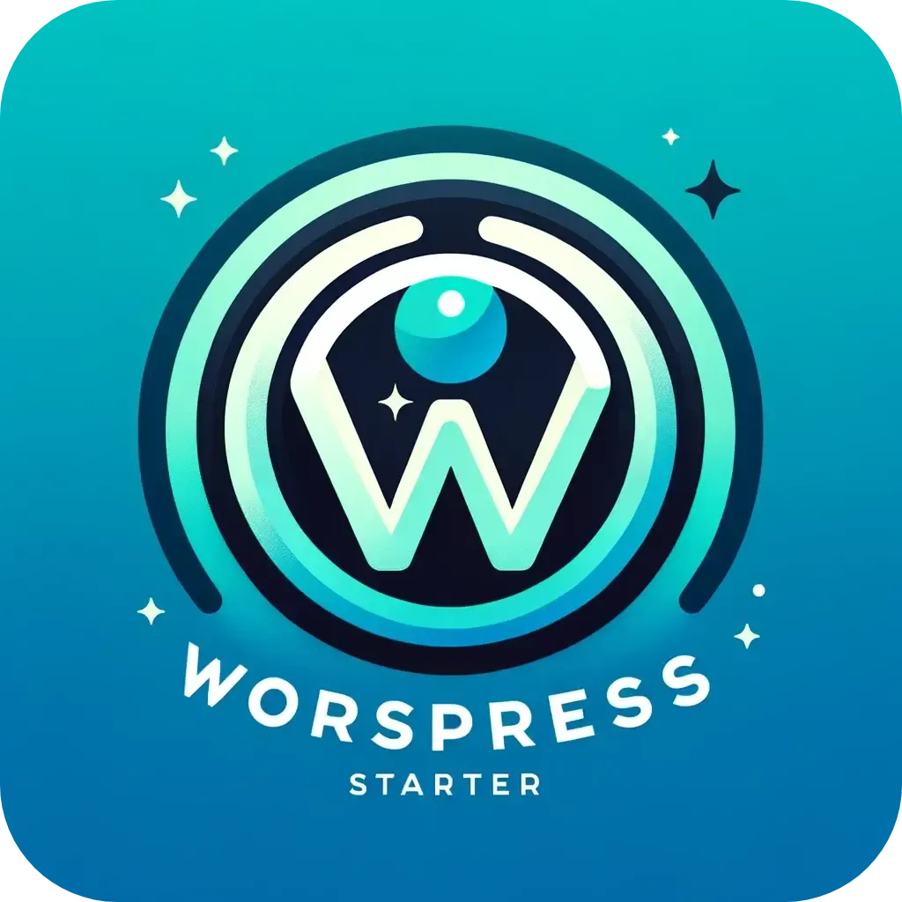

  

<h1 align="center">Modern WordPress Starter</h1>

  A streamlined WordPress setup using Docker, DDEV, and a custom initialization script to kickstart your development with ease.

## Features

- **Docker-based environment** ensuring consistency across development, staging, and production.
- **DDEV integration** for simple and powerful local development.
- **Custom Bash script** for initialising projects, managing dependencies, and setting up WordPress with best practices.
- Enhanced security and configuration through environment-specific setups.

## Prerequisites

Before you start, ensure you have Docker installed on your system. If you're new to Docker, follow the [official Docker installation guide](https://docs.docker.com/get-docker/).

DDEV is my chosen tool for managing Docker-based projects, providing a seamless and flexible development environment. If you haven't yet, install DDEV by following the instructions at [DDEV's official documentation](https://ddev.readthedocs.io/en/stable/#installation).

## Quick Start

1. **Clone the repository** to your local machine:
   
   git clone "git@github.com:lukebellis/ModernWPStarter.git"

2. **Navigate into the project directory:**

    cd modernwpstarter

3. **run the setup script from your terminal (not from within VSCode or any other IDE's terminal):**

    Make sure the script is executable: 

    chmod +x setup.sh.

    ./setup.sh

4. **Follow the prompts to customise your WordPress setup, including the site and theme names.**

Open your project in Visual Studio Code:

Run code . in your terminal to open the project.

If you're on a Mac and haven't set up the code command, open VSCode, press Cmd + Shift + P, type Shell Command: Install 'code' command in PATH, and press Enter.

Modern WordPress Starter is an open-source project. If it helps you build great sites, consider sponsoring us through GitHub Sponsors or contributing directly to the project.

